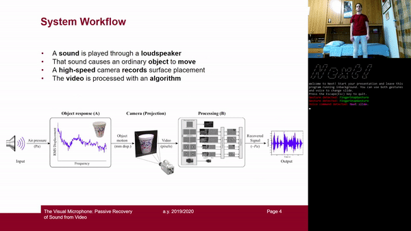

# *Next!* A tool to remote control your presentations

*Next!* allows you to change slide without using mouse and keyboard or any other kind of device that requires physical contact. Exploiting the Microsoft Kinect, it enables you to use both gestures and voice commands to control your presentations.

**Watch a demo [here](https://youtu.be/r-WBsEpnS9Q).**

## Gestures
If you want to use gestures, there are two different gestures (*Finger Snap* or *Rotate right*) to go to the next slide and one (*Rotate left*) to go back to the previous one.

### Finger Snap Gesture
You can snap your finger to go on.

  

### Rotating Gestures
Starting from an horizontal position, keep your thumb and index at the same distance and rotate either right, to go on, or left, to go back.

  

## Voice
If you prefer vocal interaction, you can use the commands "*next slide*" or "*previous slide*" to move. In case these words are said inside a sentence, they will be ignored and no action will be performed.
For example as you can see in the [demo](https://youtu.be/r-WBsEpnS9Q), if you say "*Remember what we saw in the previous slide*", the slide will not be changed.

## Setup and Dependencies
In order to use *Next!* you need a Microsoft Kinect v2 and the [Project Gesture SDK](https://www.microsoft.com/en-us/research/project/gesture/). Note that, due to these dependencies, it runs only on Microsoft Windows.
 Voice recognition works with [Microsoft Azure Speech to Text](https://azure.microsoft.com/en-us/services/cognitive-services/speech-to-text/). It needs a subscription key for Azure Cognitive Services, that can be obtained through a Microsoft account.

Once cloned or dowloaded this repository, just open the [Next.sln](Next.sln) solution in Visual Studio and run it.

## Developement
Our software exploits Kinect's depth and infrared sensors to perform gesture recognition and its microphones array for capturing voice.

Once detected a command (either gestural or vocal), a keyboard signal is sent by the program to the application running in foreground. In case you intend to go on, then the `right arrow` key is emulated, otherwise the `left arrow` one. Due to this implementation, the program can be used with any application chosen by the user, without beHoing strictly linked to a single one through an API.

### Gestural Interaction
Regarding the employed gestures, the *Finger Snap* gesture is a predefined one in the gestures SDK, while we had to define the *Rotate Right* and *Rotate Left* gestures.
The definition of a gesture is seen as a sequence of two poses.
We set a common initial pose, in which the index finger and the thumb are well spaced and in horizontal position, while the other fingers are bent. In the second pose, instead, the disposition of the fingers is the same, but the hand is rotated by 90 degrees so that the thumb and the index are in vertical position. The difference between the two gestures (right and left) is recognized because the thumb is **above** the index in the former, viceversa in the latter.

  

Our choice fell on the rotating gestures, because it is very difficult that they can be misunderstood. At the beginning we thought about using the swipe gestures, because they would have been more natural, but the problem is that while you are presenting and explaining something you tend to gesticulate a lot and a random movement could generate a false positive. However, rotating right to go on and rotating left to go back is intuitive enough and harder misunderstood.

Since going to the next slide is more frequent than going back, we decided to enhance interface flexibilty and comfort adding also the *Finger Snap* gesture to go on. It is a very easy gesture and rather impossible to confuse.

### Voice Recognition

## Authors
[Francesca Romana Mattei](https://github.com/francescaromana), [Antonio Musolino](https://github.com/antoniomuso) and [Davide Sforza](https://github.com/dsforza96).

## License
Our code is released under [MIT license](LICENSE).